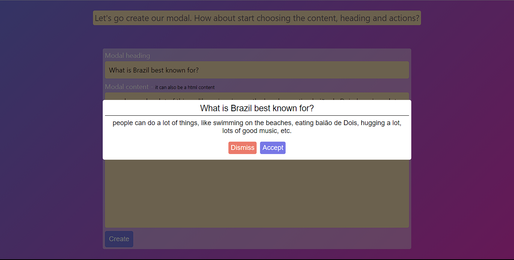

# Component Reusability | React Code Challenge

This project demonstrates component reusability in a React application. It includes a modal component that can be easily integrated into your web applications.



## Table of Contents

- [Getting Started](#getting-started)
- [Usage](#usage)
- [Folder Structure](#folder-structure)
- [License](#license)

## Getting Started

To get started with this project, follow these steps:

1. **Clone the repository to your local machine:**

```shell
git clone https://github.com/Jonorusc/code-challenges.git
```

2. **The Project is running locally**

So i recommed to download the project and run it locally using Live Server `Open with Live Server` option in VS Code.

## Usage

This project includes a reusable modal component (Modal) that you can easily integrate into your React applications. Here's how to use it:

```javascript
<Modal heading={headingText} state={modalState} onDismiss={() => closeModal()} onAccept={() => handleAccept()}>
  {/* Content for the modal */}
</Modal>
```

Customize the modal's appearance and behavior by adjusting the component's props and styles.

## Folder Structure

The project's folder structure is as follows:

```shell
React/
├── react-component-reusability/
│   ├── index.html
│   ├── index.js
│   ├── styles.css

```

## License

This project is licensed under the MIT License 
